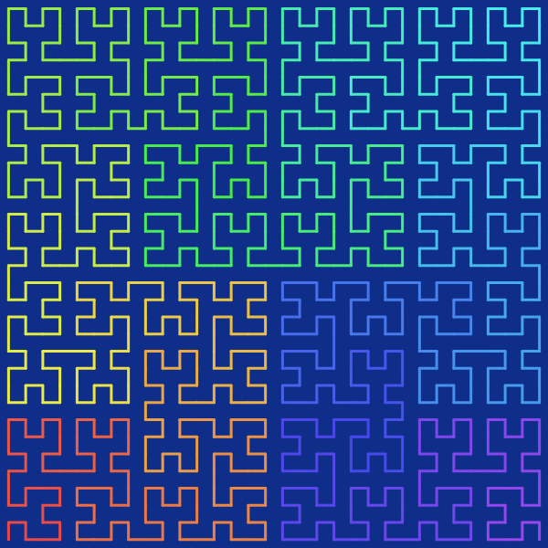

# Space-filling curve

## Definition

A [space filling curves](https://en.wikipedia.org/wiki/Space-filling_curve) is a curve whose range reaches every point in a higher dimensional region. In other words, a space filling curve is a continuous surjection $f: [0, 1] \to S$ where $S$ is an $n$-dimensional subset of $\mathbb{R}^{n}$ for some integer $n \geq 2$ with positive $n$-dimensional Lebesgue measure. Having a positive Lebesgue measure just means that it "takes up space" in $\mathbb{R}^{n}$, and is not like, say, a straight line in $\mathbb{R}^{2}$ or a smooth surface in $\mathbb{R}^{3}$.

The image below is the Hilbert curve of order 5. Note that, as is evident from the image, this is not actually a space-filling curve. The actual Hilbert curve is what we get if we take the order to tend towards infinity, at which point the curve will "fill" the entire square.

## Applications

You may be asking, what good is a curve that fills space? While the genuine space-filling curves at order infinity are interesting mostly in the mathematical sense, the ones with integer orders are actually quite useful in many areas, especially computer science. It turns out, space-filling curves are a great way to organize spacial data into an 1-dimensional arrays. More generally, when you want to represent something that lives in 2D or higher with something 1D, space-filling curves are a natural choice. This is thanks to some nice mathematical properties of these curves, namely, continuity and uniform convergence.

Continuity means that small nudges in the input space only results in small nudges in the output space. That is, there are not sudden jumps. For the purposes of storing data, this means that you can guarentee that points that are nearby in the 1D array is also nearby spacially.

Uniform convergence is a little harder to explain. If we call the $n$-th order curve $f_{n}$, and the order infinity curve $f$, then uniform converegence roughly means that there is an upper bound $\epsilon_{n}$ to $|f_{n}(x) - f(x)|$ for all $x\in[0, 1]$ ,and that $\epsilon_{n}$ tends towards $0$.

Say you got an upgrade to your hardware, and now you can afford to up the resolution to your spacial data. In order to store that data, you will now need to increase the order of the curve. Uniform convergence guarantees that if you pick any fixed parameter value $x$, let's say, the "20% mark" along the curve, the spatial location assigned to that parameter stabilizes as you raise the order. And the rate of stabilization is the same no matter which parameter value you pick.

Due to these properties, space-filling curves are widely used in spatial databases, image processing algorithms, memory layout, etc.

## Visualization

- [2D space-filling curves](./2d_curves.md)
- [3D space-filling curves](./3d_curves.md)

## Links

This project is heavily inspired by the [3Blue1Brown](https://youtube.com/@3blue1brown?si=jVFD9Bjz-uxyxTyt) channel especially by the video on [Hilbert curve](https://youtu.be/3s7h2MHQtxc?si=QTssnwHDRpOHVjCl) and the video on [fractal dimension](https://youtu.be/gB9n2gHsHN4?si=arsZlDiLwNoTG-q9).

On that note, an alternative definition of space-filling curves is that they are curves with Hausdorff dimension $n$ where $n \geq 2$ is an integer.

You can find more space-filling curves, and more generally, space-filling fractals, from the Wiki page [List of fractals by Hausdorff dimension](https://en.wikipedia.org/wiki/List_of_fractals_by_Hausdorff_dimension).